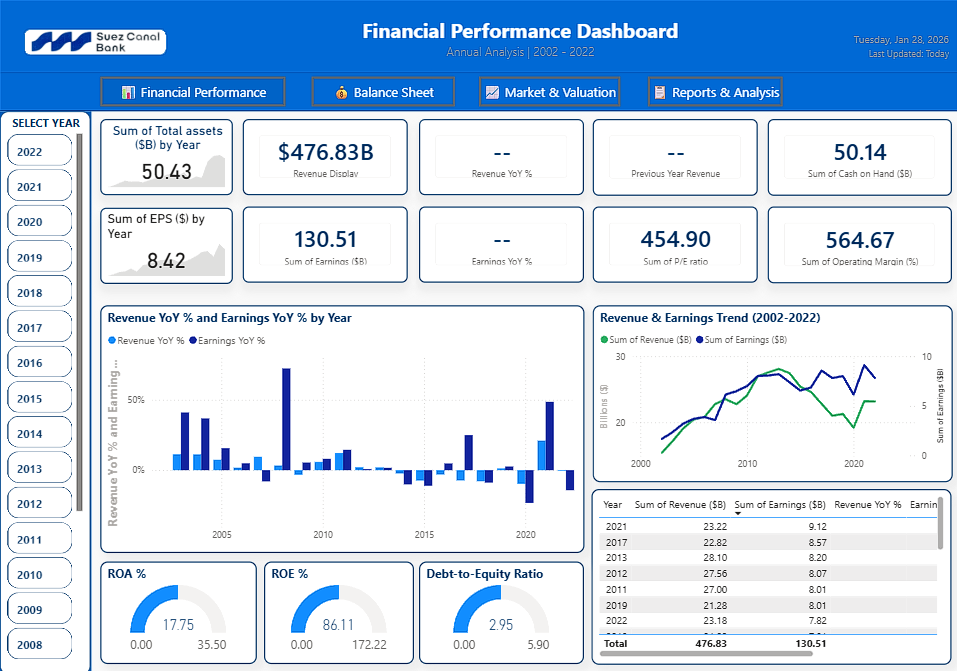
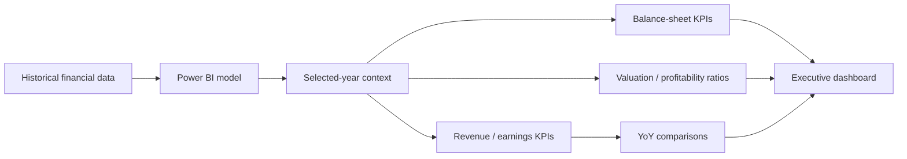

# Suez Canal Bank — Financial Performance Dashboard

Power BI portfolio project for multi-year banking financial analysis, with an emphasis on revenue, earnings, growth, balance-sheet indicators, and selected-year KPI interpretation.

> **Portfolio note:** this is an independent analytical project. It does not use confidential Suez Canal Bank data and should not be interpreted as an official bank report.

## Problem

A multi-year financial dashboard becomes misleading when it mixes different grains — for example, summing ratios across years or comparing a cumulative figure with a single-year KPI.

This project is designed to make annual performance easier to inspect while keeping selected-year values, prior-year comparisons, and ratios analytically coherent.

## What the dashboard covers

- revenue and earnings trends,
- year-over-year revenue / earnings movement,
- total assets and cash-on-hand views,
- P/E, operating margin, ROA, ROE, and debt/equity indicators,
- year selection and comparison,
- executive-style banking dashboard presentation.

## Dashboard preview

## Analytical design

The intended analytical rule is simple: **point-in-time and ratio KPIs should be interpreted at the selected-year grain, not summed across years.**

## Files

| File | Purpose |
| --- | --- |
| `ProjectSC.pbix` | Power BI project |
| `dashboard-preview.png` | Dashboard preview |
| `README.md` | Project documentation |

## Tech stack

- Power BI
- DAX / calculated measures
- data modeling
- financial KPI analysis
- interactive slicers / dashboard navigation

## Browser-based replica

A tested interactive web recreation is available in **Data Observatory**. It keeps KPI calculations in one coherent selected-year context and includes regression checks around chart bounds and selected-year logic.

**[Open the interactive web replica](https://mrwanahmedx.github.io/data-observatory/finance.html)**  
**[View Data Observatory source](https://github.com/mrwanahmedx/data-observatory)**

## What this project demonstrates

- translating raw financial history into an executive dashboard,
- separating flow metrics, point-in-time values, and ratios,
- constructing prior-year comparisons,
- designing a compact banking-style visual hierarchy,
- validating that KPI context stays internally consistent.

## Limitations

- portfolio / illustrative project, not official financial reporting,
- not a replacement for audited statements or regulatory disclosures,
- the browser replica is a web recreation, not a `.pbix` file,
- no confidential bank data is included.

## Author

**Marwan Ahmed**  
[LinkedIn](https://www.linkedin.com/in/mrwan-ahmed/) · [GitHub](https://github.com/mrwanahmedx)
